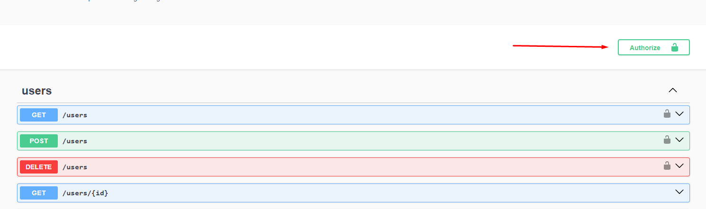

+++
title = 'Peticions API'
date = 2024-03-27T11:09:44+01:00
draft = true
weight = 3
+++

### Swagger
Per la documentació de les consultes al servidor hem fet un document Swagger on 
es mostren totes les peticions disponibles.
Per accedir al document s'ha d'anar a:
\
*{urlDelServidor}/api*

Hi ha peticions que per seguretat demanen token, per obtenir el token s'haurà de fer
la crida de */auth/login* amb un usuari i una contrasenya correctes el que retornarà el token
necessari el qual haurem de posar aqui:

