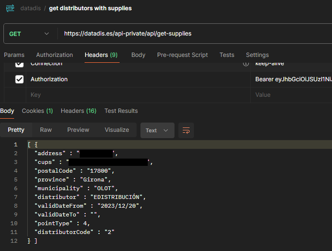

+++
title = 'Datadis'
date = 2024-03-27T11:09:44+01:00
draft = true
weight = 4
+++

### Requisits per obtenir les dades de Datadis

Per obtenir les dades de un Datadis és necessari tenir un usuari registrat. 

la petició per obtenir la autorització per obenir les dades es aquesta

https://datadis.es/nikola-auth/tokens/login

la petició de login espera un usuari i contrasenya al seu cos.

 

Amb aquesta autorització podem demanar les dades generals del client amb petició 'get-supplies'.

 

<!-- https://datadis.es/api-private/api/get-supplies

https://datadis.es/api-private/api/get-supplies?authorizedNif=43631879M

https://datadis.es/api-private/api/get-consumption-data?cups=ES0031446428360001HM0F&distributorCode=2&startDate=2024/01&endDate=2024/03&measurementType=0&pointType=5&authorizedNif=77921261K  -->